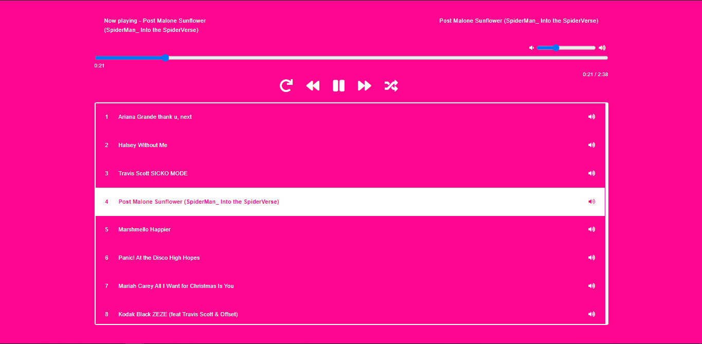

# Audio Player with React / Node JS 

## Required Node Version
Please be sure you are using `nodeJS above 8.9.3 LTS` and `npm above 6` 

## Get Started
Cloning the repository locally:

```bash
git clone git@github.com:akashsairaja/Audio-Player-HTML5-React-NodeJS.git
```

```App Overview Screen```


``` App Controls animation overiew ```


<a id="raw-url" href="https://github.com/akashsairaja/Audio-Player-HTML5-React-NodeJS/images/app/mp4"> 
Click here to Download App Video</a>
 

## Installing the app dependencies
```cmd
npm i
```  

## Running app locally 
```cmd
npm start
```

`Updating  Folder Directory`

~~~~
vi /server/index.js
line Number : 8 
update the directory with your local directory
 ~~~~

## Dependencies
   - [JavaScript](https://developer.mozilla.org/en-US/docs/Web/JavaScript)
   - [React](https://facebook.github.io/react/)
   - [Bootstrap](https://getbootstrap.com/docs/4.0/getting-started/introduction/)
